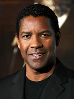

# Denzel Washington

**acteur américain • Charisme et intensité**

- **Nationalité** : Américain
- **Né(e)** : 1954
- **IMDB** : [Denzel Washington — IMDb](https://www.imdb.com/name/nm0000243/)

> «Le succès, ce n'est pas l'argent, c'est la différence que l'on fait dans la vie des gens.»

## Biographie courte

Denzel Washington est un acteur et réalisateur américain, célèbre pour ses rôles puissants et son engagement dans des films à message social. Il a remporté deux Oscars.

## Sélection filmographie

- _Training Day_ (2001)
- _Malcolm X_ (1992)
- _Fences_ (2016)

## Compétences & distinctions

- Jeu intense et charismatique
- 2 Oscars (meilleur acteur et second rôle)
